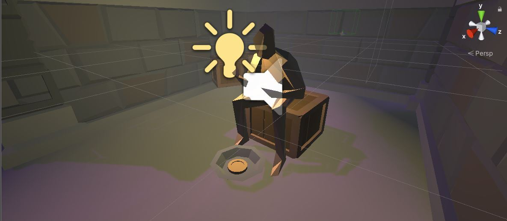
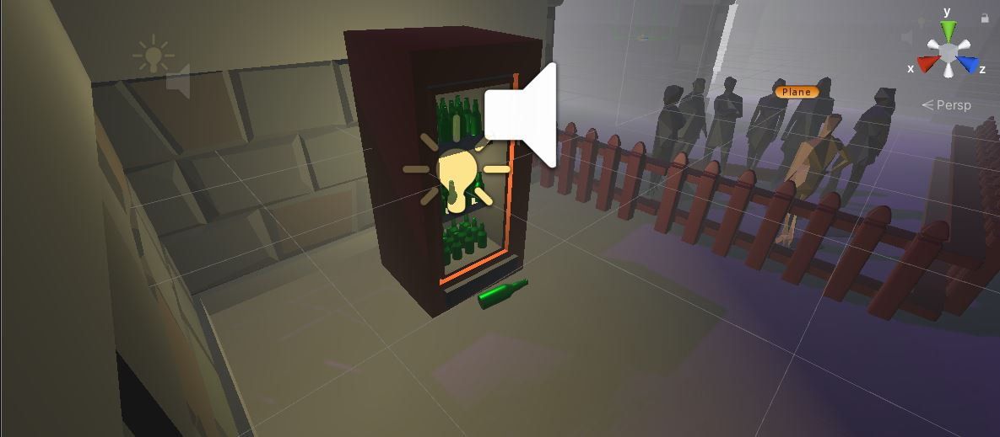
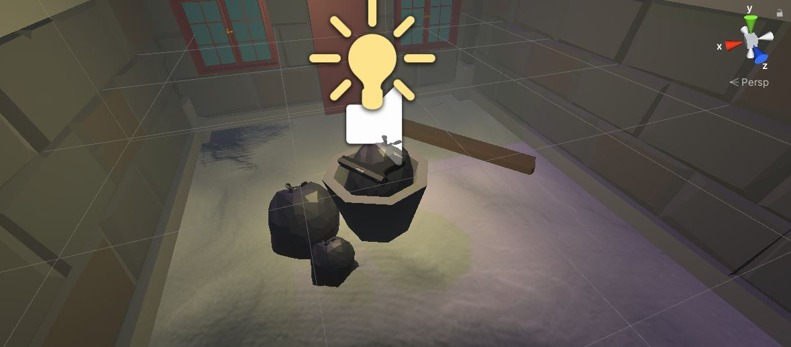
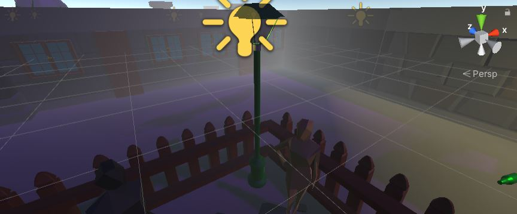
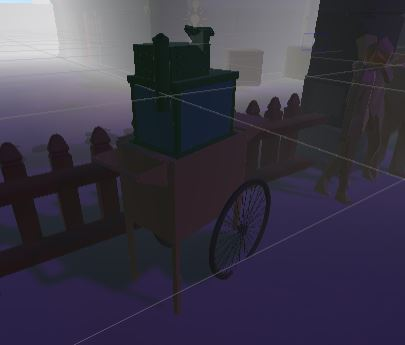
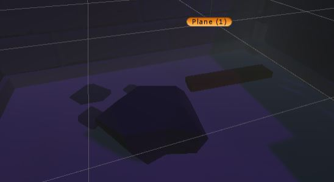
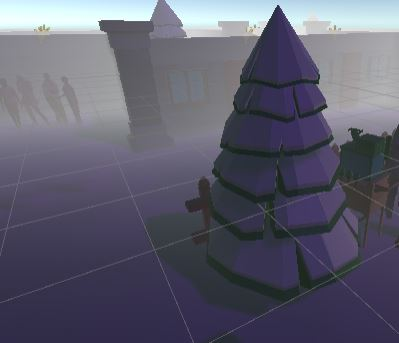

# Christmas Crimes

### Project description: 
Das Spiel erzählt die tragische Geschichte, ein arbeitsloser Alkoholiker:
 
Es passiert am 23.12 gegen Abend. (Spieler), der sich in dem Haus seiner Ehefrau regelrecht eingenistet hat, wird von seiner Frau vor die Tür gesetzt, weil sie die Situation mit ihm nicht mehr aushält.„Hier beginnt das Maze“. (Spieler) startet vor der verschlossenen Haustür. (Man befindet sich in einer keinen Stadt im Winter, es sind vereinzelt Schnee Haufen am Boden).Man hört aus der Ferne eine Stimme, diese wird immer lauter, sobald man sich ihr nähert. Machtman diesfindet man einen Bettler mit einer auffälligplatzierten geldschale vor ihm. (Spieler) nimmt sich das Geld, ohne zu zögern. Daraufhin hört man erneut aus der Ferne ein Geräusch. Es ist ein Getränke-Automat. (Spieler) wirft Geld in ihn hinein. Eine Dose kommt aus dem Automaten heraus. Danach folgt (Spieler) ein weiteres Geräusch, das von einem Mülleimer kommt. Aus der Situation heraus ist (Spieler) dazu gezwungen gegen den Mülleimer zu schlagen. Macht er dies kommt eine Waffe zum Vorschein. (Spieler) nimmt diese und geht zum ende vomMaze (dies ist die Hintertür des HausesderEhefrau).Geht (Spieler), durch diese Tür ist das Spiel zu Ende.

### Milestones
  1.Meilenstein Teleportieren als MovementMaze Template ist importiertDas Greifenfunktioniertbereits -geschaft 
 
  2. Meilenstein Aufgabe Schaffen: Geld aus schale des Bettlers nehmenWhite boxen Simple FormenOptional: -geschafft  
    (Optional) Geld selbst machen/ herunterladen -geschaft 
 
 3. Geld an Automat, Dose kommt raus; whiteboxen -geschafft  
      Alle Aufgaben Schaffen -geschafft   
     Alle Sounds, die nicht Optional sind,einbetten. -geschaft  
    (Optional) Aufgabe Schaffen:Gegen den Mülleimer schlagen daraufhin kommt eine Waffe zum Vorschein.White boxen Simple FormenOptional: Mülleimer und Waffe 
    selbstmachen/herunterladen -geschafft  
    (Optional) alle weiteren Whiteboxes mit Assets austauschen -geschafft  

### Development platform: 
Windows 10, Unity 2020.3.18f1, Visual Studio 2019

### Target platform
Virtual Reality Oculus Rift

## Software/Hardware Requirements: 
Oculus hardware requirements https://support.oculus.com/248749509016567/
You need a VR headset in this case an Oculus Rift

When downlaoded, you have compile time errors in the project. To solve them install the XR interaction toolkit package via the Package Manager. (!Enable in Advanced Settings Preview Packages).

### Visuals: 
selbst gemacht: AUTOMAT und SCHALE, Mülleimer:

### Third party material: 
Figuren, Wände, Waffe, Flasche, Tür, Fenster, Müllsäcke, Laterne, Steine und Holz, Baum, Verkaufsstand:

 

    

### Limitations/Problems: 
Ich wusste nicht, dass ich nur 50 bzw 100 MB pushen kann (bekomme seit daher einen Push-Fehler und kann nicht pushen), deshalb ist das Projet online nicht auf dem neusten stand. Genauer gesagt liegt es um die 20 commits hinten. -Problem wurde behoben

### Lessons Learned:
Ein VR-Spiel machen, Etwas in VR greifen und es von einem anderen Objekt triggern lassen, Allgemein Trigger, und Collisions, Kamera Wechseln, Sound Abspielen zu gewünschten Punkt, Athmospheren erstellen, Sound in Unity, XR-Interaction Toolkit umgehen, git Push-Fehler fixen

### OFFICAIL TRAILER; "Cristmas Crimes" (Gameplay-Video)
Derzeit in den Screenshorts vorhanden

Copyright by FKrispler
